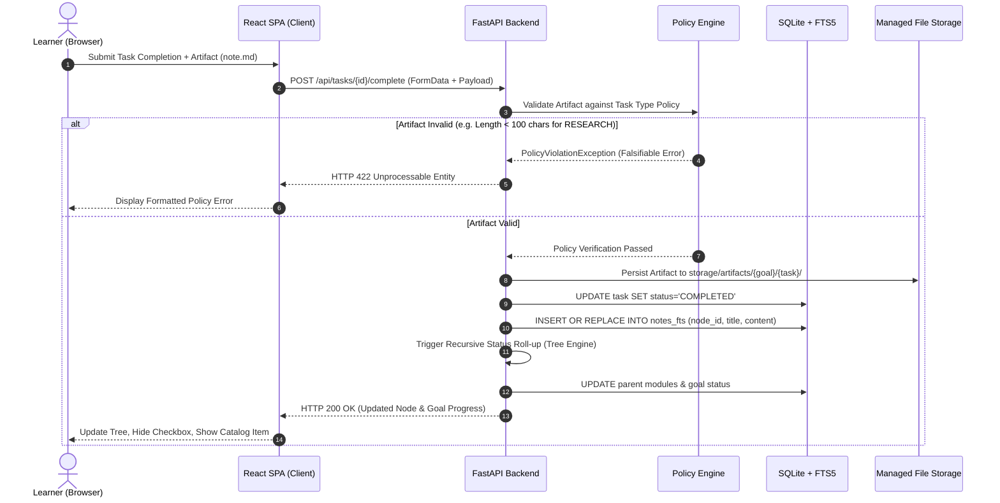
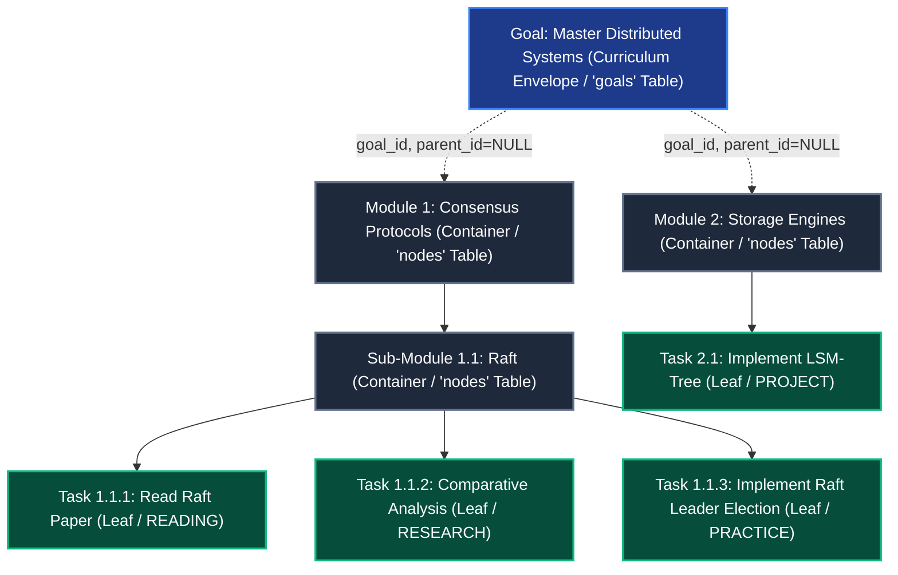
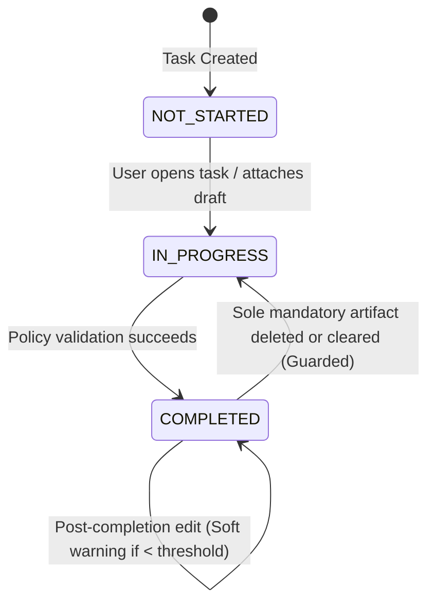
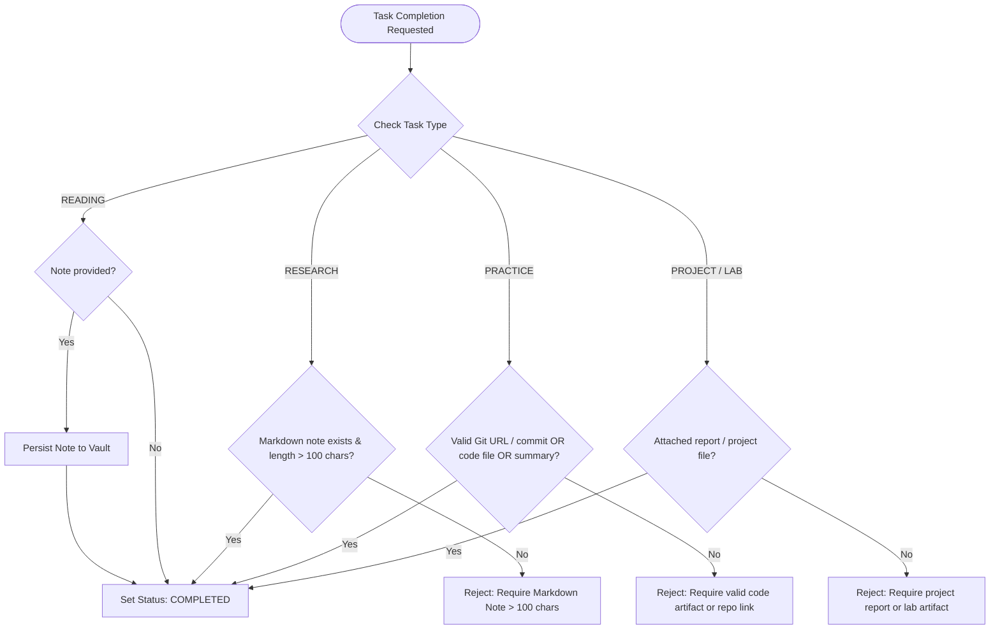

# Software Requirements Specification (SRS)
## Personal Knowledge & Learning Management System (PKLMS)

---

### Document Control

| Attribute | Specification Details |
| :--- | :--- |
| **System Name** | Personal Knowledge & Learning Management System (PKLMS) |
| **Document Type** | Software Requirements Specification (SRS) / SDD Core Artifact |
| **Document Version** | 0.2.0-draft |
| **Status** | Approved Baseline Specification (Pre-implementation Milestone 1) |
| **Development Discipline** | Specification-Driven Development (SDD) with Mandatory TDD |
| **Author / Systems Architect** | Lead System Analyst & Architect / Maksym Korniienko (KN-32) |
| **Academic Affiliation** | Department of System Design, ESC "IASA", Igor Sikorsky Kyiv Polytechnic Institute |
| **Target Runtime Environment** | Debian 12 / Ubuntu 22.04+ / Windows 11 (Python 3.11+ Runtime) |
| **Repository Location** | `spec/srs.md` |

---

### Abstract

This document defines the formal Software Requirements Specification (SRS) for the **Personal Knowledge & Learning Management System (PKLMS)**. Modern digital learning suffers from a critical structural failure: passive consumption of educational materials without verifiable retention, creating the illusion of competence while allowing acquired knowledge to decay rapidly. Traditional learning management systems (LMS) enforce institutional compliance rather than personal cognition, whereas personal knowledge management (PKM) tools lack execution discipline and task-level verification.

PKLMS resolves this dichotomy by establishing a deterministic, local-first learning execution hub. The system enables users to decompose abstract, high-level educational goals into a hierarchical tree of atomic tasks governed by strict, task-dependent completion policies (`TASK_TYPE_DEPENDENT`). A task cannot transition to a completed state without attaching a concrete, verifiable learning artifact (structured Markdown notes, executable code scripts, diagrams, or verified repository commits). As tasks are executed, the system automatically indexes and links artifacts into an evolving personal knowledge vault equipped with bidirectional wikilinks (`[[wikilink]]`), relational tag taxonomies, and an embedded SQLite FTS5 full-text search engine. 

Upon goal completion, PKLMS preserves the full hierarchical structure as an interactive, browsable Knowledge Catalog, providing instant review access and deterministic directory-tree export with relative asset normalization. The system is designed under the discipline of **Specification-Driven Development (SDD)**, where every requirement maps directly to falsifiable acceptance criteria and automated test suites before production code is introduced.

---

### Table of Contents

- [Document Control](#document-control)
- [Abstract](#abstract)
- [1. Purpose of the System](#1-purpose-of-the-system)
  - [1.1 Motivation & Vision](#11-motivation--vision)
  - [1.2 Problem Statement & Cognitive Sovereignty](#12-problem-statement--cognitive-sovereignty)
  - [1.3 Domain Glossary](#13-domain-glossary)
- [2. Prototype Boundary & Scope](#2-prototype-boundary--scope)
  - [2.1 In Scope (Phase 1, MVP)](#21-in-scope-phase-1-mvp)
  - [2.2 Out of Scope (Deferred to Phase 2 / Future Roadmap)](#22-out-of-scope-deferred-to-phase-2--future-roadmap)
- [3. Reference Technologies & Architecture](#3-reference-technologies--architecture)
  - [3.1 Reference Stack](#31-reference-stack)
  - [3.2 Local-First Storage Topology](#32-local-first-storage-topology)
  - [3.3 High-Level Component Interaction Diagram](#33-high-level-component-interaction-diagram)
  - [3.4 Repository Layout (Traceable SDD Layout)](#34-repository-layout-traceable-sdd-layout)
- [4. Development Methodology & Governance](#4-development-methodology--governance)
  - [4.1 Specification-Driven Development (SDD) Invariants](#41-specification-driven-development-sdd-invariants)
  - [4.2 Mandatory Test-Driven Development (TDD) Process](#42-mandatory-test-driven-development-tdd-process)
  - [4.3 Formal Traceability Chain](#43-formal-traceability-chain)
- [5. Requirement Identifier Scheme](#5-requirement-identifier-scheme)
  - [5.1 Taxonomy Breakdown](#51-taxonomy-breakdown)
  - [5.2 Requirement Formulation Standards (RFC 2119)](#52-requirement-formulation-standards-rfc-2119)
  - [5.3 Consolidated Functional Requirements Catalog](#53-consolidated-functional-requirements-catalog)
  - [5.4 Consolidated Non-Functional Requirements Catalog](#54-consolidated-non-functional-requirements-catalog)
- [6. System Domain Model & State Machines](#6-system-domain-model--state-machines)
  - [6.1 Educational Goal & Tree Hierarchy](#61-educational-goal--tree-hierarchy)
  - [6.2 Task Lifecycle & State Transitions](#62-task-lifecycle--state-transitions)
  - [6.3 Deterministic Status Roll-up Algorithm](#63-deterministic-status-roll-up-algorithm)
- [7. Task Execution Policies (TASK_TYPE_DEPENDENT)](#7-task-execution-policies-task_type_dependent)
  - [7.1 READING Policy Specification](#71-reading-policy-specification)
  - [7.2 RESEARCH Policy Specification](#72-research-policy-specification)
  - [7.3 PRACTICE Policy Specification](#73-practice-policy-specification)
  - [7.4 PROJECT / LAB Policy Specification](#74-project--lab-policy-specification)
  - [7.5 Mutability Rules & Guarded Deletion Mechanics](#75-mutability-rules--guarded-deletion-mechanics)
- [8. Knowledge Vault & Graph Mechanics](#8-knowledge-vault--graph-mechanics)
  - [8.1 Dual View Paradigms (Workspace Mode vs. Knowledge Catalog Mode)](#81-dual-view-paradigms-workspace-mode-vs-knowledge-catalog-mode)
  - [8.2 Wikilink Syntax and Bidirectional Graph Invariants](#82-wikilink-syntax-and-bidirectional-graph-invariants)
  - [8.3 Automated Link Refactoring on Title Modification](#83-automated-link-refactoring-on-title-modification)
  - [8.4 Full-Text Search Engine (SQLite FTS5 Integration & Tag Lookups)](#84-full-text-search-engine-sqlite-fts5-integration--tag-lookups)
- [9. Export & Portability Engine](#9-export--portability-engine)
  - [9.1 Tree Directory Mirroring Standard](#91-tree-directory-mirroring-standard)
  - [9.2 Asset Subdirectory Normalization](#92-asset-subdirectory-normalization)
  - [9.3 Manifest Synthesis (Root README.md)](#93-manifest-synthesis-root-readmemd)
- [10. Data Dictionary & Contract Specifications](#10-data-dictionary--contract-specifications)
  - [10.1 Complete SQLite DDL Schema & Relational Constraints](#101-complete-sqlite-ddl-schema--relational-constraints)
  - [10.2 Artifact Storage Directory Layout & Sanitation Rules](#102-artifact-storage-directory-layout--sanitation-rules)
  - [10.3 REST API Endpoints & Pydantic Data Contracts](#103-rest-api-endpoints--pydantic-data-contracts)
- [11. Configuration & Runtime Model](#11-configuration--runtime-model)
  - [11.1 Configuration Parameters](#111-configuration-parameters)
  - [11.2 Environment Variables & Runtime Precedence](#112-environment-variables--runtime-precedence)
- [12. Logging, Metrics & Error Handling](#12-logging-metrics--error-handling)
  - [12.1 Structured Logging (JSONL Audit Trails)](#121-structured-logging-jsonl-audit-trails)
  - [12.2 Standardized Error Responses](#122-standardized-error-responses)
  - [12.3 Recovery from Corrupted Tree States or Missing Artifacts](#123-recovery-from-corrupted-tree-states-or-missing-artifacts)
- [13. Testing Strategy & Quality Gates](#13-testing-strategy--quality-gates)
  - [13.1 Test Pyramid & Layers](#131-test-pyramid--layers)
  - [13.2 Unit Test Suite Structure (tests/unit/)](#132-unit-test-suite-structure-testsunit)
  - [13.3 Integration & API Test Suite Structure (tests/integration/)](#133-integration--api-test-suite-structure-testsintegration)
  - [13.4 Strict Quality Gates & Coverage Thresholds](#134-strict-quality-gates--coverage-thresholds)
- [14. Formal Acceptance Criteria (BDD Given-When-Then Matrix)](#14-formal-acceptance-criteria-bdd-given-when-then-matrix)
  - [14.1 Functional Acceptance Matrix](#141-functional-acceptance-matrix)
  - [14.2 Non-Functional Acceptance Criteria](#142-non-functional-acceptance-criteria)
  - [14.3 Definition of MVP Done (DoD)](#143-definition-of-mvp-done-dod)
  - [14.4 Initial Traceability Matrix](#144-initial-traceability-matrix)
- [15. Comparison with Existing Systems (Positioning Matrix)](#15-comparison-with-existing-systems-positioning-matrix)
  - [15.1 Versus Traditional Task Managers (Todoist, Trello, Asana)](#151-versus-traditional-task-managers-todoist-trello-asana)
  - [15.2 Versus Note-Taking Systems (Obsidian, Notion, Logseq)](#152-versus-note-taking-systems-obsidian-notion-logseq)
  - [15.3 Versus Classical LMS (Moodle, Canvas, Blackboard)](#153-versus-classical-lms-moodle-canvas-blackboard)
  - [15.4 Positioning Matrix & Cognitive Advantage](#154-positioning-matrix--cognitive-advantage)
- [16. Phased Implementation Plan & Post-MVP Evolution](#16-phased-implementation-plan--post-mvp-evolution)
  - [16.1 Phase Breakdown & Milestone Schedule](#161-phase-breakdown--milestone-schedule)
  - [16.2 Risk Assessment & Mitigations](#162-risk-assessment--mitigations)
  - [16.3 Phase 2 Roadmap (Post-MVP Evolution)](#163-phase-2-roadmap-post-mvp-evolution)

---

### 1. Purpose of the System

#### 1.1 Motivation & Vision
In the modern educational landscape, learners are overwhelmed by an abundance of unstructured digital resources: online video courses, documentation, research papers, and tutorials. The dominant cognitive pathology among self-directed learners is the *illusion of competence*—the mistaken belief that reading an article or watching a lecture equates to acquiring usable knowledge. Without immediate synthesis and externalized proof of work, cognitive retention decays exponentially according to Ebbinghaus's forgetting curve.

PKLMS is conceived not as a passive bookmarking utility or a generic to-do list, but as an **active cognitive enforcement apparatus**. The core vision is to transform learning into an evidence-driven engineering process:
1. **Systematic Goal Deconstruction**: Large, intimidating educational ambitions (e.g., "Master Distributed Systems Architecture") are systematically broken down into manageable, atomic components.
2. **Artifact-Enforced Completion**: Mindless checkbox checking is programmatically prevented. Every learning unit requires a tangible artifact—a concise synthesis note, an executable code snippet, or an architectural diagram.
3. **Cumulative Knowledge Synthesis**: Time invested in learning is never lost. The system accumulates artifacts into a structured, interconnected, and searchable personal knowledge base that serves as a permanent reference library.

#### 1.2 Problem Statement & Cognitive Sovereignty
Existing productivity and educational software paradigms exhibit fundamental deficiencies for deep technical learning:
- **Task Managers (Todoist, TickTick, Trello)** treat tasks as disposable checklist items. Once marked complete, tasks disappear from active cognition without leaving a persistent trace of what was actually learned.
- **Generic Note-Taking Systems (Obsidian, Notion, Logseq)** excel at knowledge storage but lack an execution engine, task lifecycles, and automated policy verification. Users frequently abandon vaults due to the absence of structured goal guidance.
- **Enterprise LMS (Moodle, Canvas, Blackboard)** are instructor-centric grading engines designed for administrative control, offering virtually zero utility for private, self-directed lifelong learning.

PKLMS introduces the principle of **Cognitive Sovereignty**:
- The human learner remains the sole author and primary thinker. 
- The system eliminates generative hallucinations and cognitive dependency by eschewing automated AI text generators in its runtime execution path.
- The system operates as a private, local-first instrument that manages structured cognitive raw material, enforcing rigor while ensuring that all personal notes, thoughts, and intellectual artifacts remain strictly confidential, deterministic, and locally owned.

#### 1.3 Domain Glossary
To establish unambiguous semantic consistency across this specification, test suites, database models, and user interfaces, the key domain terms are formally defined below:

| Term | Domain Definition & Operational Semantics |
| :--- | :--- |
| **Goal (Root Node)** | The topmost root container ($v \in V_{\text{GOAL}}$) representing an overarching learning curriculum or educational ambition. Exactly one root exists per tree. |
| **Module (Container Node)** | An intermediate structural branch node ($v \in V_{\text{MODULE}}$) used to partition goals or parent modules into logical sub-topics. Modules cannot be executed directly. |
| **Task (Leaf Node)** | The atomic, executable terminal work unit ($v \in V_{\text{TASK}}$) assigned a specific task type and completion policy. Tasks cannot have child nodes. |
| **Artifact** | A tangible, verifiable piece of educational evidence attached to a task (Markdown note, source script, diagram, PDF report, or Git commit hash). |
| **Completion Policy** | A deterministic validation rule set (`completionPolicy`) evaluating whether a task's attached artifacts satisfy the criteria to transition to `COMPLETED`. |
| **Status Roll-up** | The mathematical bottom-up propagation of leaf task completion percentages to compute parent module and goal progress and status. |
| **Wikilink** | Bidirectional hyperlinking syntax (`[[Target Title]]` or `[[Goal / Target Title]]`) creating traversable connections between disparate knowledge fragments. |
| **Link Refactoring** | The atomic, transactional rewriting of all wikilink strings across the knowledge vault when a referenced node's title is modified. |
| **Workspace Mode** | The active operational view mode of an in-progress goal ($P < 100\%$), exposing task checkboxes, editors, upload tools, and tree manipulation controls. |
| **Knowledge Catalog Mode** | The finalized view mode of a completed goal ($P = 100\%$), where execution checkboxes are concealed, transforming the tree into a cohesive reference catalog. |
| **Scaffolding** | Pre-populated section templates (e.g., `## Summary`, `## Insights`) inserted into new notes to guide structured synthesis without blocking saving if altered. |
| **Export Manifest** | The dynamically synthesized root `README.md` generated during export containing goal metadata and a hyperlinked relative Table of Contents. |

---

### 2. Prototype Boundary & Scope

#### 2.1 In Scope (Phase 1, MVP)
The Phase 1 Minimum Viable Product (MVP) delivers a self-contained, fully functioning single-user system delivering the following operational capabilities:
1. **Local-First Web Interface**: Modern, responsive Single Page Application (SPA) accessible via `http://localhost:8000` with zero authentication barriers.
2. **Goal & Tree Decomposition Engine**:
   - Dynamic creation, editing, and deletion of Goals, Modules, and Tasks.
   - Strict hierarchical constraint: Tasks exist exclusively at leaf positions.
   - Maximum nesting depth limit of 5 levels.
   - Deterministic mathematical status roll-up (`NOT_STARTED`, `IN_PROGRESS`, `COMPLETED`).
3. **Multi-Modal Artifact Verification Engine**:
   - File attachment and local storage management for Markdown (`.md`), source code (`.py`, `.sh`, `.sql`, etc.), images (`.png`, `.jpg`, `.svg`), and documents (`.pdf`).
   - Repository URL and commit hash validation for practical engineering tasks.
   - Task-type-dependent completion policies (`READING`, `RESEARCH`, `PRACTICE`, `PROJECT/LAB`) with character length threshold verification.
   - Non-blocking scaffolding templates (`## Summary`, `## Insights`) in the note editor.
4. **Knowledge Catalog & Graph Vault**:
   - Automatic transition of 100% completed goals to the interactive Knowledge Catalog mode.
   - Bidirectional `[[wikilink]]` parsing and resolution across local and cross-goal boundaries.
   - Automated global link refactoring upon node or note renaming.
   - Unified search engine combining relational `#tag` filtering and SQLite FTS5 full-text indexing.
5. **Deterministic Export Engine**:
   - One-click export of goals into a structured ZIP archive or filesystem folder.
   - Mirroring of tree hierarchy into clean subdirectories.
   - Generation of root `README.md` manifest with dynamic Table of Contents.
   - Automated asset normalization (moving binary files to `./assets/` and rewriting markdown links to relative paths).

#### 2.2 Out of Scope (Deferred to Phase 2 / Future Roadmap)
The following capabilities are deliberately excluded from the Phase 1 MVP to isolate core execution mechanics:
1. **Generative LLM Runtime Features**: Automatic note summarization, compendium generation, and autonomous task decomposition by AI agents.
2. **Multi-User Authentication & Cloud Sync**: User registration, JWT sessions, role-based access control (RBAC), and cloud synchronization (AWS S3, Google Drive).
3. **Automated Git Versioning of Artifacts**: Background automated `git commit` triggers on task completion.
4. **Real-time Collaborative Editing**: WebSockets-based simultaneous multi-device editing.
5. **Interactive Graph Visualizer**: Physics-based force-directed 2D/3D node graph canvas (e.g., Obsidian graph view).
6. **Strict Prerequisite Graph Locking**: Enforcement of sequential task prerequisites (DAG blocking gates).

---

### 3. Reference Technologies & Architecture

#### 3.1 Reference Stack
The system is built upon proven, lightweight, local-first open-source technologies:

```
+-------------------------------------------------------------------------+
|                              CLIENT LAYER                               |
|       React 18 SPA + Vite + Tailwind CSS + Lucide Icons + EasyMDE       |
+-------------------------------------------------------------------------+
                                    |
                          REST API / JSON (HTTP)
                                    v
+-------------------------------------------------------------------------+
|                             BACKEND ENGINE                              |
|          Python 3.11+ / FastAPI / Pydantic v2 / Uvicorn Server          |
|  +-------------------------------------------------------------------+  |
|  | Routers: /goals, /nodes, /tasks, /artifacts, /search, /export     |  |
|  | Services: TreeService, PolicyService, WikiService, ExportService  |  |
|  +-------------------------------------------------------------------+  |
+-------------------------------------------------------------------------+
         |                                                 |
         v                                                 v
+---------------------------+             +-------------------------------+
|     RELATIONAL / FTS5     |             |      MANAGED FILE SYSTEM      |
|    SQLite 3 (WAL Mode)    |             |       /storage/artifacts/     |
|   Metadata, Nodes, FTS5   |             |   Raw .md, .py, .png, .pdf    |
+---------------------------+             +-------------------------------+
```

- **Backend Framework**: **FastAPI** (Python 3.11+). Chosen for high execution speed, native asynchronous I/O, strict data validation via Pydantic v2, and automatic generation of OpenAPI/Swagger documentation.
- **Primary Database**: **SQLite 3** operating in Write-Ahead Logging (WAL) mode. Provides zero-configuration embedded persistence, full transactional ACID guarantees, and built-in **FTS5 (Full-Text Search)** extension for fast lexical indexing.
- **Frontend Architecture**: **React 18** paired with **Vite** and **Tailwind CSS**. Bundled at build-time and served statically directly via FastAPI's `StaticFiles` mounting point, guaranteeing single-process local deployment without requiring Node.js at runtime.
- **Editor & Rendering**: Markdown parsing and live preview via **markdown-it** / **EasyMDE**, extended with custom syntax handlers for `[[wikilinks]]` and `#tags`.

#### 3.2 Local-First Storage Topology
The local file system acts as the co-primary storage engine alongside SQLite:

```text
learning_management_system/
├── storage/
│   ├── db.sqlite3                # Master database (WAL enabled)
│   ├── db.sqlite3-wal            # SQLite write-ahead log
│   └── artifacts/                # Internal managed artifact vault
│       └── <goal_id>/
│           └── <task_id>/
│               ├── note.md       # Primary text artifact
│               ├── script.py     # Attached code artifact
│               └── assets/       # Media, diagrams, PDFs
│                   └── schema.png
```

#### 3.3 High-Level Component Interaction Diagram



#### 3.4 Repository Layout (Traceable SDD Layout)
The repository adheres to the strict Specification-Driven Development directory layout:

```text
learning_management_system/
├── docs/                         # Project reports, architectural diagrams, manuals
├── logs/                         # Audit trails, environment setup, git-gate logs
│   ├── agent-setup.md            # Agent environment registration
│   └── git-gate.md               # Gatekeeper decision records
├── spec/                         # Formal system specifications (Single Source of Truth)
│   ├── concept.md                # Initial system concept baseline
│   └── srs.md                    # This master Software Requirements Specification
├── src/                          # Production codebase
│   ├── backend/                  # FastAPI application package
│   │   ├── app/
│   │   │   ├── core/             # Configuration, logging, database connections
│   │   │   ├── models/           # SQLAlchemy / SQLModel ORM entities
│   │   │   ├── schemas/          # Pydantic request/response contracts
│   │   │   ├── services/         # Business logic (Tree, Policy, Wiki, Export)
│   │   │   └── api/              # REST API endpoint routers
│   │   └── main.py               # Application entry point & static mount
│   ├── frontend/                 # React SPA source code (Vite project)
│   └── task_schema.json          # Foundational task contract
└── tests/                        # Automated test suites (Mandatory TDD)
    ├── conftest.py               # Shared pytest fixtures & in-memory SQLite DB
    ├── unit/                     # Fast deterministic component unit tests
    ├── integration/              # API and database integration tests
    └── e2e/                      # End-to-end client-server workflow tests
```

---

### 4. Development Methodology & Governance

#### 4.1 Specification-Driven Development (SDD) Invariants
PKLMS is engineered under the strict discipline of **Specification-Driven Development (SDD)**. The specification document (`spec/srs.md`) is the authoritative, immutable contract governing the system's behavior. The source code shall not define behavior independently from the specification.

The following governing invariants apply to all engineering activities:
1. **Invariant 4.1 (Single Source of Truth)**: Every system capability, entity model, validation rule, and error condition MUST be specified in this document prior to implementation. Unspecified behavior is treated as a defect.
2. **Invariant 4.2 (Specification-Governed Git Gates)**: Code merges and feature branches MUST be evaluated against this specification. In the event of conflicting implementations between human engineers and AI coding assistants, the specification serves as the absolute baseline for conflict resolution (as demonstrated in the `logs/git-gate.md` protocol).
3. **Invariant 4.3 (Traceable Documentation Sync)**: Any intentional change to runtime architecture, schema, or API contracts requires updating this specification first, followed by updating tests, and only then modifying production code.

#### 4.2 Mandatory Test-Driven Development (TDD) Process
All functional software components MUST be developed following the strict **Red-Green-Refactor** cycle:
1. **Phase A (Red - Failing Test First)**: Write automated test cases in the appropriate directory (`tests/unit/` or `tests/integration/`) encoding the exact behavioral contract defined in the specification. Execute the test suite to confirm failure for the expected reason.
2. **Phase B (Green - Minimal Implementation)**: Implement the minimal production code in `src/` required to satisfy the test contract.
3. **Phase C (Refactor - Clean Architecture)**: Refactor the code for structural clarity, maintainability, and performance while holding all test suites green.

No functional production code shall be accepted into the `main` branch unless accompanied by automated test coverage. Fast unit tests MUST execute against an in-memory SQLite database (`:memory:`) and temporary mock directories to guarantee rapid, deterministic execution.

#### 4.3 Formal Traceability Chain
Every functional aspect of the system MUST be traceable through an unbroken operational chain:

$$\text{Requirement ID} \longrightarrow \text{Acceptance Criterion} \longrightarrow \text{Automated Test ID} \longrightarrow \text{Production Module}$$

- A feature without an assigned `REQ-` identifier is forbidden.
- A requirement without corresponding automated tests is considered incomplete and rejected at the quality gate.
- Code lacking traceability to a specific requirement identifier shall be removed.

---

### 5. Requirement Identifier Scheme

#### 5.1 Taxonomy Breakdown
All system requirements are indexed using a standardized hierarchical identifier scheme:

$$\mathbf{REQ}\text{--}\mathbf{AREA}\text{--}\mathbf{NNN}$$

The functional areas are defined as follows:

| Area Tag | Functional Subsystem Domain | Description & Responsibilities |
| :--- | :--- | :--- |
| **`REQ-TREE`** | Tree Hierarchy & Decomposition | Goal creation, module nesting, strict leaf task constraints, and recursive status roll-up. |
| **`REQ-POLICY`** | Task Completion Policies | Execution verification rules for `READING`, `RESEARCH`, `PRACTICE`, and `PROJECT/LAB`. |
| **`REQ-ARTIFACT`** | Artifact Vault Management | File upload, storage isolation, MIME whitelisting, size bounds, and guarded deletion. |
| **`REQ-WIKI`** | Knowledge Base & Wikilinks | Tagging, bidirectional `[[wikilink]]` resolution, and automated graph refactoring on rename. |
| **`REQ-EXPORT`** | Export & Portability Engine | Directory tree mirroring, asset normalization, and dynamic root `README.md` manifest synthesis. |
| **`REQ-UI`** | User Interface & Editor | Workspace Mode, Knowledge Catalog Mode, embedded Markdown editor, and live preview. |

#### 5.2 Requirement Formulation Standards (RFC 2119)
Requirements in this document are authored using the formal normative keywords defined in **RFC 2119**:
- **MUST / SHALL / REQUIRED**: Absolute, non-negotiable operational requirements.
- **MUST NOT / SHALL NOT**: Absolute technical prohibitions.
- **SHOULD / RECOMMENDED**: Valid architectural preferences where alternative implementations require explicit documentation and justification.
- **MAY / OPTIONAL**: Truly elective features or post-MVP extensions.

#### 5.3 Consolidated Functional Requirements Catalog

| Requirement ID | Subsystem | Normative Statement (RFC 2119) | Observable Verification |
| :--- | :--- | :--- | :--- |
| **`REQ-TREE-001`** | Hierarchy | The system SHALL allow the user to create, edit, reorder, and delete Goals, Modules, and Tasks in a recursive tree structure. | Tree CRUD operations succeed via REST API and Web UI. |
| **`REQ-TREE-002`** | Hierarchy | Executable Tasks SHALL exist strictly as leaf nodes. Container modules and top-level goal allocations SHALL NOT hold direct Tasks if sub-modules are present. | Schema rejects mixed children with HTTP 422. |
| **`REQ-TREE-003`** | Hierarchy | The tree hierarchy depth from root Goal to any leaf Task SHALL NOT exceed 5 levels. | Insertion at depth $> 5$ rejected with HTTP 422. |
| **`REQ-TREE-004`** | Hierarchy | The system SHALL compute status and progress percentage bottom-up automatically using the deterministic roll-up algorithm. | Progress calculation updates immediately on task completion. |
| **`REQ-TREE-005`** | Hierarchy | When a Goal achieves 100% completion, the system SHALL automatically transition it from Workspace Mode to Knowledge Catalog Mode; adding new uncompleted nodes SHALL revoke Catalog Mode. | UI conceals checkboxes and reveals catalog viewer; adding nodes reverts to Workspace. |
| **`REQ-POLICY-001`**| Execution | The system SHALL allow completing `READING` tasks via an Acknowledge button without requiring an artifact, but SHALL save notes if provided. | Task marked `COMPLETED` on click. |
| **`REQ-POLICY-002`**| Execution | The system SHALL require a Markdown note exceeding 100 effective characters (excluding Markdown syntax, whitespace, and default scaffolding headers) before permitting a `RESEARCH` task to transition to `COMPLETED`. | Rejects notes $\le 100$ effective characters with HTTP 422. |
| **`REQ-POLICY-003`**| Execution | The system SHALL require a valid Git repository URL/commit hash, local script file, or Markdown summary ($>100$ chars) for `PRACTICE` tasks. | Validates URL regex or file existence before completion. |
| **`REQ-POLICY-004`**| Execution | The system SHALL require an attached project file, report, or compiled summary ($>0$ bytes) before completing a `PROJECT/LAB` task. | Verifies attached file presence and size $> 0$. |
| **`REQ-POLICY-005`**| Execution | If a completed note is edited below the character threshold, the system SHALL retain `COMPLETED` status and display an inline non-blocking warning. | Warning banner renders; status remains `COMPLETED`. |
| **`REQ-ARTIFACT-001`**| Storage | The system SHALL store uploaded artifacts in sandboxed directories with sanitized filenames preventing path traversal attacks. | Filename sanitized; file persisted under goal/task folder. |
| **`REQ-ARTIFACT-002`**| Storage | The system SHALL reject any uploaded artifact whose MIME type is not present in the defined whitelist. | Unwhitelisted MIME returns HTTP 415. |
| **`REQ-ARTIFACT-003`**| Storage | Deletion of the sole qualifying artifact (or clearing `git_url` on a completed `PRACTICE` task without other artifacts) MUST prompt a confirmation guard and revert task status to `IN_PROGRESS`. | Confirmation dialog displayed; status reverts on confirm. |
| **`REQ-WIKI-001`** | Vault | The system SHALL parse and resolve local `[[Note Title]]` and cross-goal `[[Goal / Note Title]]` wikilinks to internal node entities. | Active hyperlink created linking to target note. |
| **`REQ-WIKI-002`** | Vault | When a node's title is modified, the system SHALL atomically update all referencing `[[wikilinks]]` across all notes in the database and filesystem. | Batch regex replace updates referencing notes. |
| **`REQ-WIKI-003`** | Vault | The system SHALL provide full-text search across note titles and contents using an embedded SQLite FTS5 index. | FTS query returns ranked results with snippets. |
| **`REQ-WIKI-004`** | Vault | The system SHALL extract `#tags` from Markdown notes and support faceted tag filtering in the knowledge catalog. | Tag cloud filters notes matching selected tags. |
| **`REQ-EXPORT-001`**| Export | The system SHALL export the Goal hierarchy into a mirrored folder structure with zero-padded alphabetical prefixes. | Exported ZIP unpacks into ordered directories. |
| **`REQ-EXPORT-002`**| Export | The export engine SHALL isolate media attachments into per-module `./assets/` folders and normalize markdown image links to relative paths. | Links rewritten to ``; images readable. |
| **`REQ-EXPORT-003`**| Export | The export engine SHALL synthesize a root `README.md` manifest with complete curriculum metadata and an interactive Table of Contents. | `README.md` present at export root with relative links. |
| **`REQ-UI-001`** | Interface | The web interface SHALL provide distinct Workspace Mode (for active tasks) and Knowledge Catalog Mode (for completed goals). | View switches dynamically based on Goal progress. |
| **`REQ-UI-002`** | Interface | The web interface SHALL embed a Markdown editor with scaffolding templates (`## Summary`, `## Insights`) and live character counters. | Scaffolding injected into empty notes; counter updates. |

#### 5.4 Consolidated Non-Functional Requirements Catalog

| Requirement ID | Quality Attribute | Normative Statement (RFC 2119) | Observable Verification Metric |
| :--- | :--- | :--- | :--- |
| **`REQ-NF-001`** | **Performance** | SQLite FTS5 search queries and status roll-up evaluations SHALL execute in under 50 ms and 15 ms respectively for up to 10,000 tasks. | Automated performance benchmark test in `tests/integration/`. |
| **`REQ-NF-002`** | **Privacy & Offline Autonomy** | The system SHALL function entirely offline and SHALL NOT initiate any outbound network connections or telemetry calls. | Network isolation verification test verifying 0 socket connections. |
| **`REQ-NF-003`** | **Portability** | Exported curricula SHALL adhere strictly to CommonMark standard without proprietary syntax, ensuring 100% compatibility with Obsidian and GitHub. | Exported test vault parses with 0 errors in external markdown parser. |
| **`REQ-NF-004`** | **Fault Tolerance** | The SQLite database SHALL operate with Write-Ahead Logging (WAL) enabled, and the system SHALL recover gracefully from missing files. | Database integrity check and self-healing service pass integration tests. |
| **`REQ-NF-005`** | **Maintainability** | The codebase SHALL adhere to strict static typing (`mypy --strict`) and maintain $\ge 90\%$ test coverage on service logic. | CI pipeline passes `mypy` and `pytest --cov=src` without errors. |
| **`REQ-NF-006`** | **Security** | All filesystem read/write operations SHALL validate canonical paths against the storage root to prevent arbitrary file access. | Path traversal unit tests (`../../`) fail safely with HTTP 400. |

---

### 6. System Domain Model & State Machines

#### 6.1 Educational Goal & Tree Hierarchy
The core data structure of PKLMS models each curriculum through a clean separation of the overarching Goal entity (persisted in the `goals` table) and its internal hierarchical tree of content nodes (persisted in the `nodes` table). Top-level nodes directly child to the Goal maintain `parent_id = NULL` and point to `goal_id`.



The domain model enforces three structural invariants:
1. **Invariant 6.1 (Strict Node Typing & Decoupled Envelope)**: The `goals` table stores high-level curriculum metadata (`id`, `title`, `description`, `status`, `progress`). The content tree inside the `nodes` table is partitioned strictly into two disjoint sets:
   $$V_{\text{nodes}} = V_{\text{MODULE}} \cup V_{\text{TASK}}$$
   where $V_{\text{MODULE}}$ are structural container nodes and $V_{\text{TASK}}$ are executable leaf work units. The type `'GOAL'` is excluded from `node_type`, eliminating denormalization and redundant record creation.
2. **Invariant 6.2 (Strict Leaf-Level Tasks & Homogeneous Containers)**: Executable tasks MUST exist strictly as leaf nodes:
   $$\forall v \in V_{\text{TASK}} \implies \text{deg}^+(v) = 0$$
   Container modules ($V_{\text{MODULE}}$) MUST NOT mix sub-modules and executable tasks:
   $$\forall v \in V_{\text{MODULE}}, \quad \text{Children}(v) \subset V_{\text{MODULE}} \lor \text{Children}(v) \subset V_{\text{TASK}}$$
   Similarly, top-level children of a Goal (`parent_id = NULL`) MUST be homogeneous:
   $$\text{TopNodes}(goal) \subset V_{\text{MODULE}} \lor \text{TopNodes}(goal) \subset V_{\text{TASK}}$$
3. **Invariant 6.3 (Nesting Depth Boundary)**: The path length from a top-level node down to any leaf task node SHALL NOT exceed 5 levels:
   $$\forall v \in V_{\text{nodes}}, \quad 1 \le \text{depth}(v) \le 5$$

#### 6.2 Task Lifecycle & State Transitions
Every task $v \in V_{\text{TASK}}$ maintains a formal lifecycle governed by a finite state machine:



The valid states and transition triggers are defined as follows:
- **`NOT_STARTED`**: Initial state. No work has been recorded.
- **`IN_PROGRESS`**: Active state. The learner is drafting notes or working on artifacts.
- **`COMPLETED`**: Terminal successful state. The task's assigned `completionPolicy` has been satisfied and verified.
- **Guarded State Rollback**: If a learner permanently deletes the sole attached artifact of a completed `MANDATORY` task (or clears the qualifying `git_url` on a completed `PRACTICE` task without other files), the system MUST display a confirmation guard warning that the action will revert the task to `IN_PROGRESS`. Upon confirmation, the status transitions to `IN_PROGRESS` and triggers recursive parent roll-up.

#### 6.3 Deterministic Status Roll-up Algorithm
The completion progress $P(v) \in [0, 100]$ across all tree nodes and goals is evaluated bottom-up deterministically by `TreeService`:

1. **For Leaf Tasks ($v \in V_{\text{TASK}}$)**:
   - $P(v) = 100.0$, if $\text{Status}(v) = \text{COMPLETED}$
   - $P(v) = 0.0$, if $\text{Status}(v) \neq \text{COMPLETED}$

2. **For Container Modules ($v \in V_{\text{MODULE}}$)**:
   - **Empty Container Progress Penalty**: Any container module without child nodes ($|\text{Children}(v)| = 0$) MUST strictly evaluate to:
     $$P(v) = 0.0\%, \quad \text{Status}(v) = \text{NOT\_STARTED}$$
     Empty modules participate in parent average calculations, preventing premature completion of unpopulated curricula.
   - For populated container modules ($|\text{Children}(v)| > 0$):
     $$P(v) = \frac{1}{|\text{Children}(v)|} \sum_{u \in \text{Children}(v)} P(u)$$

3. **For Educational Goals (`goals` Table)**:
   The overall goal progress $P(goal)$ aggregates all top-level nodes ($\text{TopNodes}(goal) = \{u \in V_{\text{nodes}} \mid u.\text{goal\_id} = goal.\text{id} \land u.\text{parent\_id} \text{ IS NULL}\}$):
   $$P(goal) = \begin{cases} 0.0\%, & \text{if } |\text{TopNodes}(goal)| = 0 \\ \frac{1}{|\text{TopNodes}(goal)|} \sum_{u \in \text{TopNodes}(goal)} P(u), & \text{if } |\text{TopNodes}(goal)| > 0 \end{cases}$$

**Status Mapping**:
- **`NOT_STARTED`**: $P(v) = 0.0$
- **`IN_PROGRESS`**: $0.0 < P(v) < 100.0$
- **`COMPLETED`**: $P(v) = 100.0$

In a single atomic SQLite transaction, `TreeService` writes the calculated `progress` and `status` to intermediate `nodes` and persists final `progress` and `status` to the `goals` table.

**Catalog Mode Transition & Revocation Invariant**:
- When $P(goal) = 100.0\%$, the Goal transitions automatically from **Workspace Mode** to **Knowledge Catalog Mode**.
- **Catalog Mode Revocation**: If a new module or task is added to a Goal currently in Knowledge Catalog Mode ($P = 100\%$), the resulting roll-up recalculation causes $P(goal) < 100\%$. The system MUST automatically revert the Goal's operational state to **Workspace Mode**, restoring task manipulation, checkboxes, and execution controls until all items are completed.

---

### 7. Task Execution Policies (`TASK_TYPE_DEPENDENT`)



#### 7.1 READING Policy Specification
- **Task Semantic**: Passive learning activities: reading documentation, listening to lectures, watching technical videos.
- **Completion Policy**: `OPTIONAL_ARTIFACT`.
- **Validation Rules**:
  1. The user MAY mark the task as `COMPLETED` directly via an "Acknowledge" button without attaching an artifact.
  2. If the user provides a Markdown note, the system SHALL persist it to the managed storage and index it into the knowledge vault.

#### 7.2 RESEARCH Policy Specification
- **Task Semantic**: Active analytical learning: technology evaluation, architectural comparison, literature review.
- **Completion Policy**: `STRICT_MANDATORY_NOTE`.
- **Validation Rules**:
  1. The task MUST have an associated Markdown note.
  2. The text content of the note MUST exceed **100 effective characters** of user-authored synthesis.
  3. **Scaffolding Text Normalization Rule**: The character validation function for `RESEARCH` notes MUST evaluate meaningful user-authored body content:
     - All Markdown syntax tokens (`#`, `*`, `_`, `[]`, `()`, `-`, `>`) and newline/whitespace sequences MUST be stripped.
     - The default scaffolding header labels (`Summary`, `Insights`) SHALL NOT count toward the mandatory 100-character requirement.
     - **Algorithmic Contract**:
       $$\text{EffectiveChars} = \text{len}(\text{regex\_clean}(\text{raw\_markdown})) \ge 100$$
       where `regex_clean` strips Markdown syntax, structural header tokens (`## Summary`, `## Insights`), and leading/trailing whitespace.
  4. **UI Real-Time Counter**: The embedded editor (`Editor.tsx`) SHALL display a live character counter reflecting strictly the effective non-scaffolding character count (e.g., `42 / 100 characters required`) to prevent user confusion before submission.
  5. The note editor SHALL pre-populate scaffolding headers (`## Summary`, `## Insights`), but SHALL NOT reject completion if headers are customized, provided `EffectiveChars` $\ge 100$.

#### 7.3 PRACTICE Policy Specification
- **Task Semantic**: Hands-on technical tasks: writing code, configuring servers, debugging, solving algorithmic exercises.
- **Completion Policy**: `STRICT_MANDATORY_CODE_OR_REPO`.
- **Validation Rules**:
  1. The user MUST provide at least one of the following valid artifacts:
     - An uploaded script/code file (`.py`, `.js`, `.ts`, `.go`, `.rs`, `.sql`, `.sh`, `.cpp`, `.java`, etc.).
     - A valid remote Git repository URL (matching standard regex `^https?://.*\.git$` or `^https?://(github|gitlab|bitbucket)\.com/.+`) with optional commit SHA.
     - A Markdown summary note describing the implementation results ($> 100$ characters).
  2. **Virtual Artifact Equivalence**: A valid `git_url` (and optional `commit_hash`) stored in the `tasks` table is semantically treated as an active completion artifact for `PRACTICE` tasks, satisfying policy verification without requiring a physical file in the `artifacts` table.

#### 7.4 PROJECT / LAB Policy Specification
- **Task Semantic**: Milestone delivery: completing a laboratory assignment, developing a capstone module.
- **Completion Policy**: `STRICT_MANDATORY_PROJECT_ARTIFACT`.
- **Validation Rules**:
  1. The task MUST have an attached project archive (`.zip`), documentation report (`.pdf`, `.md`), or a comprehensive compiled summary artifact.
  2. The attached artifact file MUST exist in storage and have a size $> 0$ bytes.

#### 7.5 Mutability Rules & Guarded Deletion Mechanics
1. **Post-Completion Editing**: All notes and artifacts remain fully editable after task completion. If subsequent edits cause the character count of a `RESEARCH` note to drop below 100 effective characters, the task SHALL remain in the `COMPLETED` state, but the UI editor SHALL display an inline non-blocking warning: *"Note is below suggested length (100 characters)"*.
2. **Guarded Mandatory Artifact Deletion**: Deletion of the sole qualifying artifact for a `COMPLETED` mandatory task (`RESEARCH`, `PRACTICE`, `PROJECT`) MUST prompt an explicit confirmation dialog: *"Deleting this artifact will invalidate task completion criteria and revert the task to IN_PROGRESS. Proceed?"*. If confirmed, the system SHALL set task status to `IN_PROGRESS`, delete the file from storage, and recalculate parent roll-up progress.
3. **Guarded Modification & Clearance of Virtual Git Artifacts**: Clearing, removing, or replacing the `git_url` on a `COMPLETED` `PRACTICE` task that possesses no other attached files in `artifacts` is strictly classified as an **Artifact Deletion Event**:
   - Any API request (`PATCH` or `PUT /api/tasks/{id}`) attempting to nullify or clear `git_url` on a completed task without other qualifying artifacts MUST require explicit confirmation (`force=true` or guarded confirmation parameter).
   - Upon confirmed execution, the task status MUST automatically transition to `IN_PROGRESS`, triggering parent progress roll-up recalculation.

---

### 8. Knowledge Vault & Graph Mechanics

#### 8.1 Dual View Paradigms (Workspace Mode vs. Knowledge Catalog Mode)
PKLMS enforces a clear dichotomy between task execution and knowledge consumption through two distinct operational view paradigms:

1. **Workspace Mode (Execution & Decomposition)**:
   - **Active State**: Displayed whenever a Goal has a completion progress $P(goal) < 100.0\%$.
   - **Capabilities**:
     - Tree decomposition and task manipulation (creating, editing, reordering, and deleting modules and tasks).
     - Interactive execution controls: "Acknowledge" buttons for `READING`, artifact upload widgets for `PRACTICE`/`PROJECT`, and embedded Markdown editors for `RESEARCH`.
     - Real-time progress bars indicating status roll-up across parent modules and overarching goal.
2. **Knowledge Catalog Mode (Review & Synthesis)**:
   - **Finalized State**: Automatically triggered when a Goal reaches $P(goal) = 100.0\%$.
   - **Capabilities**:
     - Operational checkboxes and completion buttons are concealed to eliminate cognitive friction.
     - The tree hierarchy transforms into an interactive, read-only/editable navigation catalog.
     - The user navigates seamlessly through completed modules and tasks as a cohesive knowledge base.
     - Notes remain open to continuous refinement and editing, serving as an evolving reference asset.
   - **Catalog Mode Revocation**: If structural changes are introduced (e.g., adding a new module or task, or guarded deletion of an artifact) that drop $P(goal) < 100.0\%$, the Goal instantly reverts to **Workspace Mode**, re-exposing operational checkboxes and editing controls.

#### 8.2 Wikilink Syntax and Bidirectional Graph Invariants
The knowledge vault implements an interconnected graph structure using the standard wikilink syntax with extended scoping:
- **Local Scope Wikilink**: `[[Target Task Title]]` resolves to a task note within the current Goal.
- **Intra-Goal Module Scoped Wikilink**: `[[Module Title / Target Task Title]]` explicitly targets a task residing within a specific parent module of the active Goal.
- **Cross-Goal Scoped Wikilink**: `[[Goal Title / Target Task Title]]` resolves to a specific task note belonging to a different Goal.
- **Full Path Scoped Wikilink**: `[[Goal Title / Module Title / Target Task Title]]` resolves unambiguously across all goals and modules.

**Deterministic Resolution Hierarchy**:
When resolving an unscoped or ambiguous link `[[Target Title]]`, the resolver evaluates candidate targets according to a strict 4-step precedence hierarchy:
1. **Step 1 (Local Module Scope)**: Sibling task within the same parent `module_id` as the source note.
2. **Step 2 (Local Goal Scope)**: Unique matching task within the active `goal_id`.
3. **Step 3 (Ambiguity Fallback & User Advisory)**: If multiple tasks share the exact same title within the active Goal, resolve to the earliest created record (`created_at ASC`) and surface a non-blocking UI ambiguity badge advising the user to qualify the link as `[[Module Title / Target Title]]`.
4. **Step 4 (Global Scope)**: Earliest created matching task across all external goals (`created_at ASC`).

**Schema Preservation**:
Titles in the SQLite `nodes` table deliberately omit a `UNIQUE(goal_id, title)` constraint. This allows learners to naturally repeat task names (e.g., *"Lab 1 Report"* or *"Summary Notes"*) across different modules while relying on the deterministic resolution hierarchy to navigate the graph.

The system maintains a relational index of all links in the `wikilinks` table, enabling instantaneous extraction of **Backlinks** (notes that reference the current note) to facilitate associative learning and knowledge discovery.

#### 8.3 Automated Link Refactoring on Title Modification
To prevent the silent corruption of knowledge links ("bit rot"), PKLMS implements transactional graph consistency:
- **Requirement 8.3.1 (Atomic Refactoring)**: When a learner modifies the title of any node $v$ from $T_{old}$ to $T_{new}$, the system MUST execute a transactional batch scan across all stored Markdown notes in the database and filesystem.
- **Requirement 8.3.2 (Regex Replacement)**: All instances matching `[[T_{old}]]`, `[[Module / T_{old}]]`, or `[[Goal / T_{old}]]` MUST be atomically rewritten to reflect $T_{new}$.
- **Requirement 8.3.3 (Graph Synchronization)**: The internal `wikilinks` relational table MUST be refreshed immediately following the title update to reflect the updated target references.

#### 8.4 Full-Text Search Engine (SQLite FTS5 Integration & Tag Lookups)
The search subsystem delivers sub-millisecond retrieval across the learner's entire knowledge vault without requiring heavy external search clusters.

1. **SQLite FTS5 Integration & Unified Table Naming**:
   - All note titles, Markdown bodies, and extracted text artifacts are indexed in the virtual table `notes_fts` using SQLite's FTS5 extension.
   - The index employs Unicode61 tokenization with case-folding, enabling diacritic-insensitive and case-insensitive search across multilingual text.
   - Queries support prefix matching (e.g., `distrib*`), exact phrase matching (`"consensus algorithm"`), and boolean combinations (`raft AND NOT paxos`).
2. **FTS5 Lifecycle & Synchronization Invariant**:
   - Because SQLite FTS5 virtual tables do not support relational constraints (`FOREIGN KEY ... ON DELETE CASCADE`), all FTS index mutations are managed directly by `WikiService` and `StorageService` within the same ACID transaction:
     - **Index on Create/Update**: When a note or task title is persisted or updated, the service executes:
       ```sql
       INSERT OR REPLACE INTO notes_fts (node_id, title, content) VALUES (?, ?, ?);
       ```
     - **Cleanup on Delete**: When a node or its artifact is deleted, the service explicitly executes:
       ```sql
       DELETE FROM notes_fts WHERE node_id = ?;
       ```
       prior to deleting the relational node record.
     - **Consistency Reconciliation**: The administrative routine `TreeService.recalculate_all_goals()` provides an automated rebuild command:
       ```sql
       INSERT INTO notes_fts(notes_fts) VALUES('rebuild');
       ```
       to restore index integrity during vault recovery.
3. **Relational Tag Indexing**:
   - The UI editor automatically extracts hashtag tokens (matching regex `#[a-zA-Z0-9_\-]+`) from note content and maps them into the relational `tags` and `node_tags` tables.
   - The search interface exposes a dual-filter paradigm: learners can select multiple `#tags` from a faceted tag cloud while typing lexical keywords to isolate specific learning units with breadcrumb-annotated result cards (`Goal > Module > Task`).

---

### 9. Export & Portability Engine

#### 9.1 Tree Directory Mirroring Standard
The export engine guarantees absolute data portability by transforming the database-backed Goal tree into an open, human-readable directory structure on the local filesystem.

Exporting a Goal produces the following canonical layout:

```text
Exported_Goal_Name/
├── README.md                     # Root manifest & Table of Contents
├── 01_Module_Name/
│   ├── 01_Task_Research_note.md  # Primary Markdown note
│   ├── 02_Task_Practice_script.py# Code artifact placed adjacent to note
│   └── assets/                   # Isolated media attachments
│       ├── diagram_1.png
│       └── reference_doc.pdf
└── 02_Module_Name/
    ├── 01_Task_Reading_note.md
    └── 02_Task_Lab_project.zip
```

Directory and file names are prefixed with two-digit zero-padded ordering indices (`01_`, `02_`) derived from the node's `position` attribute to guarantee identical alphabetical sorting across external file explorers.

#### 9.2 Asset Subdirectory Normalization
During the export compilation process:
1. **Asset Migration**: All binary attachments (PNG, JPG, SVG, PDF) associated with tasks inside a module are copied into a localized `assets/` subfolder within that module's directory.
2. **Link Rewriting**: The export engine parses all Markdown files and normalizes internal artifact URIs (e.g., `/api/artifacts/download/{id}`) into standard relative Markdown links (e.g., ``).
3. **External Compatibility**: The resulting folder structure is fully functional in standard local Markdown readers (Obsidian, VS Code, Foam, GitHub) without broken image links or missing references.

#### 9.3 Manifest Synthesis (Root README.md)
The export engine dynamically synthesizes a comprehensive `README.md` manifest at the root of the exported directory containing:
- **Goal Header**: Title, description, creation date, completion timestamp, and total number of verified artifacts.
- **Curriculum Architecture**: A complete, formatted Table of Contents representing the hierarchical tree, with hyperlinked relative paths to every task note:
  ```markdown
  # Curriculum: Distributed Systems Architecture
  > Completed on: 2026-09-18 | Total Artifacts: 14

  ## Table of Contents
  - [Module 1: Consensus Protocols](./01_Consensus_Protocols/README.md)
    - [Task 1.1: Raft Paper Notes](./01_Consensus_Protocols/01_Raft_Paper_Notes.md)
    - [Task 1.2: Leader Election Implementation](./01_Consensus_Protocols/02_Leader_Election.py)
  ```

---

### 10. Data Dictionary & Contract Specifications

#### 10.1 Complete SQLite DDL Schema & Relational Constraints

```sql
-- SQLite Master Schema for PKLMS (WAL Mode Enabled)
PRAGMA foreign_keys = ON;

-- 1. Goals Table (Curriculum Envelope)
CREATE TABLE goals (
    id TEXT PRIMARY KEY,
    title TEXT NOT NULL,
    description TEXT DEFAULT '',
    status TEXT NOT NULL CHECK(status IN ('NOT_STARTED', 'IN_PROGRESS', 'COMPLETED')),
    progress REAL NOT NULL DEFAULT 0.0 CHECK(progress >= 0.0 AND progress <= 100.0),
    created_at TEXT NOT NULL,
    updated_at TEXT NOT NULL,
    completed_at TEXT
);

-- 2. Nodes Table (Adjacency List Tree Model: MODULE containers & TASK work units)
-- Top-level modules or direct tasks child to Goal maintain parent_id IS NULL and point to goal_id
CREATE TABLE nodes (
    id TEXT PRIMARY KEY,
    goal_id TEXT NOT NULL,
    parent_id TEXT,
    node_type TEXT NOT NULL CHECK(node_type IN ('MODULE', 'TASK')),
    title TEXT NOT NULL,
    description TEXT DEFAULT '',
    depth INTEGER NOT NULL CHECK(depth >= 1 AND depth <= 5),
    position INTEGER NOT NULL DEFAULT 0,
    status TEXT NOT NULL CHECK(status IN ('NOT_STARTED', 'IN_PROGRESS', 'COMPLETED')),
    progress REAL NOT NULL DEFAULT 0.0 CHECK(progress >= 0.0 AND progress <= 100.0),
    created_at TEXT NOT NULL,
    updated_at TEXT NOT NULL,
    FOREIGN KEY (goal_id) REFERENCES goals(id) ON DELETE CASCADE,
    FOREIGN KEY (parent_id) REFERENCES nodes(id) ON DELETE CASCADE
);

-- 3. Tasks Table (Specific to Leaf Task Nodes)
-- Virtual Artifact Note: PRACTICE tasks can satisfy policy via git_url / commit_hash without an artifacts row
CREATE TABLE tasks (
    node_id TEXT PRIMARY KEY,
    task_type TEXT NOT NULL CHECK(task_type IN ('READING', 'RESEARCH', 'PRACTICE', 'PROJECT')),
    completion_policy TEXT NOT NULL,
    is_mandatory INTEGER NOT NULL CHECK(is_mandatory IN (0, 1)),
    git_url TEXT,
    commit_hash TEXT,
    FOREIGN KEY (node_id) REFERENCES nodes(id) ON DELETE CASCADE
);

-- 4. Artifacts Table
CREATE TABLE artifacts (
    id TEXT PRIMARY KEY,
    task_node_id TEXT NOT NULL,
    filename TEXT NOT NULL,
    stored_path TEXT NOT NULL,
    mime_type TEXT NOT NULL,
    size_bytes INTEGER NOT NULL CHECK(size_bytes >= 0),
    char_count INTEGER DEFAULT 0,
    created_at TEXT NOT NULL,
    updated_at TEXT NOT NULL,
    FOREIGN KEY (task_node_id) REFERENCES tasks(node_id) ON DELETE CASCADE
);

-- 5. Tags Table
CREATE TABLE tags (
    id TEXT PRIMARY KEY,
    name TEXT NOT NULL UNIQUE
);

-- 6. Node-Tags Junction Table
CREATE TABLE node_tags (
    node_id TEXT NOT NULL,
    tag_id TEXT NOT NULL,
    PRIMARY KEY (node_id, tag_id),
    FOREIGN KEY (node_id) REFERENCES nodes(id) ON DELETE CASCADE,
    FOREIGN KEY (tag_id) REFERENCES tags(id) ON DELETE CASCADE
);

-- 7. Wikilinks Graph Table
CREATE TABLE wikilinks (
    id TEXT PRIMARY KEY,
    source_node_id TEXT NOT NULL,
    target_node_id TEXT,
    raw_link_text TEXT NOT NULL,
    created_at TEXT NOT NULL,
    FOREIGN KEY (source_node_id) REFERENCES nodes(id) ON DELETE CASCADE,
    FOREIGN KEY (target_node_id) REFERENCES nodes(id) ON DELETE SET NULL
);

-- 8. FTS5 Virtual Table for Full-Text Search
-- Maintained synchronously by WikiService / StorageService within the host transaction
CREATE VIRTUAL TABLE notes_fts USING fts5(
    node_id UNINDEXED,
    title,
    content,
    tokenize = 'unicode61 remove_diacritics 2'
);
```

#### 10.2 Artifact Storage Directory Layout & Sanitation Rules
- **Physical Path Structure**: All binary files and raw Markdown files are saved under:
  $$\text{storage/artifacts/}\{\text{goal\_id}\}/\{\text{task\_node\_id}\}/\{\text{sanitized\_filename}\}$$
- **Sanitization Rule**: Filenames uploaded by users MUST be stripped of directory traversal tokens (`../`, `..\`) and special characters using a strict regex: `filename = re.sub(r'[^a-zA-Z0-9_.-]', '_', filename)`.
- **MIME Whitelist**: Only files matching the following whitelisted MIME types SHALL be accepted:
  - Markdown: `text/markdown`, `text/plain` (`.md`, `.txt`)
  - Code: `text/x-python`, `text/javascript`, `text/x-c`, `text/x-rust`, `text/x-sql`, `text/x-sh`
  - Media: `image/png`, `image/jpeg`, `image/svg+xml`, `image/webp`
  - Documents & Archives: `application/pdf`, `application/zip`

#### 10.3 REST API Endpoints & Pydantic Data Contracts

| Method | Endpoint Route | Request Payload Schema | Response Payload Schema | Description |
| :--- | :--- | :--- | :--- | :--- |
| `GET` | `/api/goals` | None | `list[GoalResponse]` | List all goals with progress and status |
| `POST` | `/api/goals` | `GoalCreateRequest` | `GoalResponse` | Create a new top-level educational goal |
| `PUT` | `/api/goals/{id}` | `GoalUpdateRequest` | `GoalResponse` | Update goal title or description |
| `GET` | `/api/goals/{id}/tree` | None | `GoalTreeResponse` | Fetch full hierarchical node tree |
| `POST` | `/api/nodes` | `NodeCreateRequest` | `NodeResponse` | Add child module or task node |
| `PUT` | `/api/nodes/{id}` | `NodeUpdateRequest` | `NodeResponse` | Update node title/position (triggers link refactoring) |
| `DELETE` | `/api/nodes/{id}` | None | `StatusRollupResponse` | Delete node and recalculate parent roll-up |
| `POST` | `/api/tasks/{id}/complete` | `Multipart/Form-Data` | `TaskCompleteResponse` | Submit artifact & evaluate policy gate |
| `PATCH` | `/api/tasks/{id}` | `TaskPatchRequest` | `TaskCompleteResponse` | Update task fields (e.g. git_url; guarded deletion if cleared) |
| `POST` | `/api/tasks/{id}/rollback` | None | `TaskCompleteResponse` | Revert task to IN_PROGRESS |
| `GET` | `/api/search` | `?q={query}&tags={tag}` | `list[SearchHitResponse]` | Execute combined FTS5 + Tag search |
| `GET` | `/api/export/{goal_id}` | None | Binary Stream (ZIP) | Export goal tree and assets as ZIP archive |

**Pydantic Contract Definitions (Python 3.11+)**:

```python
from pydantic import BaseModel, Field
from typing import Optional, Literal
from datetime import datetime

# --- Goal Contracts ---

class GoalBase(BaseModel):
    title: str = Field(..., min_length=1, max_length=200, description="Title of the educational curriculum")
    description: Optional[str] = Field(default="", max_length=2000, description="Scope and learning objectives")

class GoalCreateRequest(GoalBase):
    pass

class GoalUpdateRequest(BaseModel):
    title: Optional[str] = Field(default=None, min_length=1, max_length=200)
    description: Optional[str] = Field(default=None, max_length=2000)

class GoalResponse(GoalBase):
    id: str
    status: Literal["NOT_STARTED", "IN_PROGRESS", "COMPLETED"]
    progress: float = Field(..., ge=0.0, le=100.0)
    created_at: datetime
    updated_at: datetime
    completed_at: Optional[datetime] = None

# --- Node Contracts ---

class NodeBase(BaseModel):
    title: str = Field(..., min_length=1, max_length=200)
    description: Optional[str] = Field(default="")
    node_type: Literal["MODULE", "TASK"]

class NodeCreateRequest(NodeBase):
    goal_id: str
    parent_id: Optional[str] = Field(default=None, description="NULL for top-level modules/tasks within the goal")
    task_type: Optional[Literal["READING", "RESEARCH", "PRACTICE", "PROJECT"]] = None
    position: Optional[int] = Field(default=0, ge=0)

class NodeUpdateRequest(BaseModel):
    title: Optional[str] = Field(default=None, min_length=1, max_length=200)
    description: Optional[str] = None
    parent_id: Optional[str] = Field(default=None, description="Allows reparenting with depth and container checks")
    position: Optional[int] = Field(default=None, ge=0)

class NodeResponse(NodeBase):
    id: str
    goal_id: str
    parent_id: Optional[str]
    depth: int = Field(..., ge=1, le=5)
    position: int
    status: Literal["NOT_STARTED", "IN_PROGRESS", "COMPLETED"]
    progress: float = Field(..., ge=0.0, le=100.0)
    created_at: datetime
    updated_at: datetime

class NodeTreeResponse(NodeResponse):
    task_type: Optional[Literal["READING", "RESEARCH", "PRACTICE", "PROJECT"]] = None
    completion_policy: Optional[str] = None
    git_url: Optional[str] = None
    commit_hash: Optional[str] = None
    children: list["NodeTreeResponse"] = Field(default_factory=list)

class GoalTreeResponse(GoalResponse):
    root_nodes: list[NodeTreeResponse] = Field(default_factory=list)

# --- Task Execution & Mutation Contracts ---

class TaskPatchRequest(BaseModel):
    git_url: Optional[str] = None
    commit_hash: Optional[str] = None
    confirm_clear_virtual_artifact: bool = Field(
        default=False, 
        description="Must be True when clearing git_url on a completed task without other artifacts"
    )

class TaskCompleteResponse(BaseModel):
    task_id: str
    status: Literal["COMPLETED", "IN_PROGRESS"]
    policy_satisfied: bool
    attached_artifacts_count: int
    updated_parent_progress: float

class StatusRollupResponse(BaseModel):
    affected_node_id: str
    updated_progress: float
    updated_status: Literal["NOT_STARTED", "IN_PROGRESS", "COMPLETED"]
    goal_id: str
    goal_progress: float
    goal_status: Literal["NOT_STARTED", "IN_PROGRESS", "COMPLETED"]

# --- Search Contracts ---

class SearchHitResponse(BaseModel):
    node_id: str
    goal_id: str
    title: str
    snippet: str
    breadcrumb: str
    match_type: Literal["fts", "tag"]
    rank: float
```

---

### 11. Configuration & Runtime Model

#### 11.1 Configuration Parameters
The system centralizes operational settings in a single Pydantic Settings object:

| Configuration Parameter | Type | Default Value | Description |
| :--- | :--- | :--- | :--- |
| `PKLMS_HOST` | String | `"127.0.0.1"` | Binding network interface for the local server |
| `PKLMS_PORT` | Integer | `8000` | Port for the local FastAPI server |
| `PKLMS_STORAGE_ROOT` | Path | `"./storage"` | Base directory for database and file vault |
| `PKLMS_MAX_FILE_SIZE_MB`| Integer | `50` | Maximum upload limit for binary artifacts (images, PDFs) |
| `PKLMS_MAX_CODE_SIZE_MB`| Integer | `5` | Maximum upload limit for raw code/script artifacts |
| `PKLMS_RESEARCH_MIN_CHARS`| Integer | `100` | Minimum character length for `RESEARCH` markdown notes |
| `PKLMS_LOG_LEVEL` | String | `"INFO"` | Logging verbosity (`DEBUG`, `INFO`, `WARNING`, `ERROR`) |

#### 11.2 Environment Variables & Runtime Precedence
Configuration settings are resolved deterministically using standard layered precedence (highest priority first):
1. **Command-Line Arguments** (passed when launching Uvicorn / server).
2. **Environment Variables** (prefixed with `PKLMS_`).
3. **Local YAML Configuration File** (`pklms.yaml` located in working directory).
4. **Built-in Application Defaults**.

---

### 12. Logging, Metrics & Error Handling

#### 12.1 Structured Logging (JSONL Audit Trails)
All critical state mutations and task completions are emitted as structured JSONL log entries to `./logs/audit.jsonl` to ensure non-repudiation and auditability:

```json
{
  "timestamp": "2026-09-18T01:10:00.124Z",
  "level": "INFO",
  "event": "TASK_COMPLETED",
  "goal_id": "goal-8a1f",
  "task_id": "task-4b2c",
  "task_type": "RESEARCH",
  "policy": "STRICT_MANDATORY_NOTE",
  "artifact_id": "art-9f3e",
  "char_count": 284,
  "execution_duration_ms": 14.2
}
```

#### 12.2 Standardized Error Responses
All API error responses adhere to the **RFC 7807 (Problem Details for HTTP APIs)** specification:

```json
{
  "type": "https://pklms.local/errors/policy-violation",
  "title": "Policy Verification Failed",
  "status": 422,
  "detail": "RESEARCH task requires a markdown note with at least 100 characters. Received 42 characters.",
  "instance": "/api/tasks/task-4b2c/complete"
}
```

#### 12.3 Recovery from Corrupted Tree States or Missing Artifacts
- **Missing File Recovery**: If an artifact record exists in SQLite but the corresponding file is missing from `./storage/artifacts/`, the system SHALL NOT crash. It SHALL flag the task with a warning state (`CORRUPTED_ARTIFACT`), prevent export completion, and prompt the user to re-upload the missing file.
- **Roll-up Recalculation & Index Rebuild Command**: The system provides an internal reconciliation service (`TreeService.recalculate_all_goals()`) that scans all nodes and deterministically rebuilds all progress percentages from leaf tasks upward, repairing any desynchronized intermediate states. Additionally, it executes `INSERT INTO notes_fts(notes_fts) VALUES('rebuild')` to guarantee 100% lexical search index consistency across all notes and tasks.

---

### 13. Testing Strategy & Quality Gates

#### 13.1 Test Pyramid & Layers
Under the mandatory TDD discipline, tests serve as the primary executable contract verifying that production code satisfies every specified requirement:

```text
               / \
              /   \      E2E Tests (tests/e2e/)
             / E2E \     - Full browser workflow via Playwright
            /-------\
           / Integ.  \   Integration Tests (tests/integration/)
          /           \  - FastAPI TestClient, real SQLite DB & filesystem
         /-------------\
        /  Unit Tests   \ Unit Tests (tests/unit/)
       /                 \ - Isolated domain models, algorithms, in-memory DB
      +-------------------+
```

1. **Unit Test Layer (`tests/unit/`)**: Fast, deterministic tests exercising domain algorithms, policy validations, and tree invariants in isolation. All unit tests run against in-memory SQLite (`:memory:`) in under 2 seconds total.
2. **Integration Test Layer (`tests/integration/`)**: Tests HTTP endpoints, database migrations, FTS5 queries, file system persistence, and ZIP export mechanics using FastAPI's `TestClient` and temporary filesystem directories (`tmp_path`).
3. **End-to-End Test Layer (`tests/e2e/`)**: Validates full browser workflows (e.g., node creation, live Markdown editing, task completion, mode switching to Knowledge Catalog) using Playwright.

#### 13.2 Unit Test Suite Structure (`tests/unit/`)

| Test File | Target Subsystem | Behavioral Contracts Tested |
| :--- | :--- | :--- |
| `test_tree.py` | Tree & Domain Model | Node creation, strict leaf-level constraints, 5-level depth limit, recursive status roll-up calculation. |
| `test_policy.py` | Policy Engine | `READING` acknowledgment, `RESEARCH` 100-character threshold, `PRACTICE` code/git URL validation, `PROJECT` artifact presence. |
| `test_artifact.py` | Storage Engine | Path sanitization, directory traversal attack prevention, MIME type whitelisting, size limits, guarded deletion. |
| `test_wiki.py` | Knowledge Graph | Local and cross-goal `[[wikilink]]` extraction, hashtag parsing, transactional link refactoring on title modification. |
| `test_export.py` | Portability Engine | Tree-to-directory mirroring, asset relocation to `./assets/`, relative markdown link normalization, `README.md` manifest synthesis. |

#### 13.3 Integration & API Test Suite Structure (`tests/integration/`)

| Test File | Scope of Integration | Expected Outcome |
| :--- | :--- | :--- |
| `test_api_goals.py` | `/api/goals` CRUD endpoints | Goals created with status `NOT_STARTED`; progress reflects leaf task completions. |
| `test_api_nodes.py` | `/api/nodes` tree hierarchy | Rejects mixed container nodes; enforces maximum depth of 5; reorders positions cleanly. |
| `test_api_tasks.py` | `/api/tasks/{id}/complete` | Returns HTTP 422 on policy failure; returns HTTP 200 on valid artifact; cascades parent roll-up. |
| `test_api_search.py` | `/api/search` (FTS5 + Tags) | Returns accurate hits matching Unicode keywords and combined `#tags` with sub-50ms latency. |
| `test_api_export.py` | `/api/export/{goal_id}` | Generates valid ZIP stream; contains well-formed `README.md` manifest and functional relative links. |

#### 13.4 Strict Quality Gates & Coverage Thresholds
The project CI pipeline and local git hooks enforce the following automated gates before any commit or pull request is accepted into `main`:
1. **Linter & Formatter Cleanliness**: `ruff check .` and `ruff format --check .` MUST pass with zero errors and zero warnings.
2. **Type Safety**: `mypy --strict src/` MUST complete with zero type violations.
3. **Automated Test Execution**: `pytest tests/unit/ tests/integration/` MUST achieve 100% green status.
4. **Code Coverage Threshold**: The automated test suite MUST maintain a minimum test coverage of **$\ge 90\%$** across all business logic modules in `src/backend/app/services/`.

---

### 14. Formal Acceptance Criteria (BDD Given-When-Then Matrix)

##### 14.1 Functional Acceptance Matrix

| Requirement ID | Scenario ID | Scenario Description | Given (Initial State) | When (Trigger Action) | Then (Expected Outcome) |
| :--- | :--- | :--- | :--- | :--- | :--- |
| **`REQ-TREE-001`** | `SCEN-TREE-001` | Tree entity CRUD & reparenting | Empty curriculum repository | User creates a Goal, appends Modules, and adds Tasks | Tree structure persists with valid parent references, positions, and depths. |
| **`REQ-TREE-002`** | `SCEN-TREE-002` | Mixed container prohibition | A Module node containing sub-modules (or Goal with modules) | User attempts to add a direct Task child | The system rejects the addition with HTTP 422: "Cannot add task to container with sub-modules". |
| **`REQ-TREE-003`** | `SCEN-TREE-003` | 5-level depth boundary | A node hierarchy at depth 5 | User attempts to add a child node | The system rejects the addition with HTTP 422: "Maximum tree depth of 5 levels reached". |
| **`REQ-TREE-004`** | `SCEN-TREE-004` | Deterministic roll-up & empty penalty | A Module with 2 tasks (1 COMPLETED, 1 NOT_STARTED) and an empty Module | Leaf task state mutates | Progress calculates bottom-up deterministically; empty module evaluates to 0.0% and NOT_STARTED. |
| **`REQ-TREE-005`** | `SCEN-TREE-005` | Catalog mode transition & revocation | A Goal with 99% progress in Workspace Mode | Final remaining task is COMPLETED, and later a new uncompleted task is added | Progress reaches 100% and activates Knowledge Catalog Mode; adding new task drops progress below 100% and revokes to Workspace Mode. |
| **`REQ-POLICY-001`** | `SCEN-POLICY-001` | READING acknowledgment | A READING task with no attached note | User clicks "Acknowledge" button | Task transitions to COMPLETED with zero errors; note is saved to vault if provided. |
| **`REQ-POLICY-002`** | `SCEN-POLICY-002` | RESEARCH scaffolding-clean threshold | A RESEARCH task with scaffolding (`## Summary`, `## Insights`) and 45 body characters | User requests task completion | System rejects completion with HTTP 422: "Effective user text (45 chars) is below mandatory 100-character threshold". |
| **`REQ-POLICY-003`** | `SCEN-POLICY-003` | PRACTICE repo/code validation | A PRACTICE task with git URL `https://github.com/org/repo.git` | User requests task completion | Policy engine validates regex, accepts the URL as virtual artifact, and transitions task to COMPLETED. |
| **`REQ-POLICY-004`** | `SCEN-POLICY-004` | PROJECT/LAB artifact check | A PROJECT task with no attached report or 0-byte file | User requests task completion | System rejects completion with HTTP 422: "Mandatory project artifact (> 0 bytes) is required". |
| **`REQ-POLICY-005`** | `SCEN-POLICY-005` | Soft warning on edit | A COMPLETED RESEARCH task with a 150-char note | User edits note down to 80 chars | Status remains COMPLETED; editor displays inline warning: "Note is below suggested length". |
| **`REQ-ARTIFACT-001`**| `SCEN-ART-001` | Path sanitization & sandbox | User uploads file with filename `../../etc/passwd` | Backend sanitizes uploaded filename | Filename is sanitized to `______etc_passwd` and stored strictly inside sandboxed goal/task folder. |
| **`REQ-ARTIFACT-002`**| `SCEN-ART-002` | MIME whitelist rejection | User uploads file with unapproved MIME type (`application/x-dosexec`) | Storage service inspects MIME type | Upload is rejected with HTTP 415: "Unsupported Media Type". |
| **`REQ-ARTIFACT-003`**| `SCEN-ART-003` | Guarded deletion & virtual git clearance | A COMPLETED task with sole qualifying artifact (file or `git_url`) | User attempts to delete artifact or clear `git_url` | UI/API prompts confirmation guard (`force=true`); on confirm, artifact/git_url is removed and task reverts to IN_PROGRESS. |
| **`REQ-WIKI-001`** | `SCEN-WIKI-001` | Wikilink parsing & scoped resolution | Notes containing `[[Task]]`, `[[Module/Task]]`, or `[[Goal/Task]]` | Resolver evaluates target hierarchy | Resolves to sibling module task, intra-goal match, or scoped target with backlinks extracted. |
| **`REQ-WIKI-002`** | `SCEN-WIKI-002` | Automated link refactoring | Note A contains link `[[Old Title]]` | User renames task from "Old Title" to "New Title" | Note A content is atomically updated to `[[New Title]]`; `wikilinks` table updates target reference. |
| **`REQ-WIKI-003`** | `SCEN-WIKI-003` | FTS5 full-text retrieval | Vault contains note with term "Byzantine fault" | User searches query `byzantine` | Search returns task hit with snippet and breadcrumb `Distributed Systems > Consensus`. |
| **`REQ-WIKI-004`** | `SCEN-WIKI-004` | Tag taxonomy extraction | Note contains tags `#distributed #consensus` | Note is saved | Tags are extracted into `tags` and `node_tags` tables; faceted filtering returns matching tasks. |
| **`REQ-EXPORT-001`** | `SCEN-EXP-001` | Directory tree mirroring | A Goal with multi-level modules and tasks | User requests ZIP export | Export engine unpacks into ordered directories with zero-padded prefixes (`01_Module/`). |
| **`REQ-EXPORT-002`** | `SCEN-EXP-002` | Relative link & asset normalization | Note references internal image `/api/artifacts/123` | User downloads Goal ZIP export | Note in ZIP contains normalized relative path ``; image is present in `./assets/`. |
| **`REQ-EXPORT-003`** | `SCEN-EXP-003` | Root README manifest synthesis | A 100% completed Goal exported to ZIP | Export engine completes archive compilation | Root `README.md` manifest contains full curriculum metadata and clickable relative Table of Contents. |
| **`REQ-UI-001`** | `SCEN-UI-001` | Workspace vs Catalog view switching | A Goal transitioning between <100% and 100% progress | Status roll-up crosses 100% boundary | UI seamlessly toggles between execution controls (Workspace) and cohesive reading view (Catalog). |
| **`REQ-UI-002`** | `SCEN-UI-002` | Markdown editor & live counter | Empty RESEARCH note opened in editor | User types note content | Editor injects default scaffolding (`## Summary`, `## Insights`) and displays live counter of effective non-scaffold characters. |

#### 14.2 Non-Functional Acceptance Criteria
1. **Local Latency Budget**:
   - SQLite query and FTS5 search response times SHALL NOT exceed **50 ms** for vaults containing up to 10,000 tasks.
   - Status roll-up calculation across a 500-node tree SHALL NOT exceed **15 ms**.
2. **Zero Cloud Leaks & Offline Autonomy**:
   - The system SHALL function with 100% feature completeness in an isolated offline environment without an active internet connection.
   - Zero telemetry, analytics, or outbound network calls SHALL be made by either the frontend or backend runtime.
3. **Data Portability Guarantee**:
   - All exported ZIP packages SHALL open cleanly in external Markdown viewers (Obsidian, VS Code) with 0 broken asset links and 0 unrendered text notes.

#### 14.3 Definition of MVP Done (DoD)
The PKLMS Phase 1 MVP is formally declared **DONE** when and only when all of the following criteria are verified:
1. All functional requirements (`REQ-TREE`, `REQ-POLICY`, `REQ-ARTIFACT`, `REQ-WIKI`, `REQ-EXPORT`, `REQ-UI`) pass their mapped automated test suites.
2. 100% of the BDD acceptance scenarios defined in Section 14.1 execute green.
3. Code quality gates (`ruff`, `mypy --strict`, test coverage $\ge 90\%$) pass cleanly without overrides.
4. An end-to-end user workflow (Goal creation $\to$ multi-level decomposition $\to$ task completion with artifacts $\to$ catalog review $\to$ ZIP export) completes successfully in the web browser.
5. This SRS specification is fully synchronized with the implementation without unresolved deviations.

#### 14.4 Initial Traceability Matrix
In accordance with SDD governance (Invariant 4.3), the initial traceability matrix binds each formal Requirement ID to its observable Acceptance Criterion, BDD Scenario, and planned verification targets:

| Requirement ID | Requirement Summary | Acceptance Criterion ID | BDD Scenario ID | Planned Test ID | Planned Target Module | Implementation Status |
| :--- | :--- | :--- | :--- | :--- | :--- | :---: |
| **`REQ-TREE-001`** | Recursive Goal/Module/Task CRUD | `ACCEPT-TREE-001` | `SCEN-TREE-001` | `TEST-UNIT-TREE-01` | `services/tree_service.py` | SPECIFIED |
| **`REQ-TREE-002`** | Strict leaf task constraint | `ACCEPT-TREE-002` | `SCEN-TREE-002` | `TEST-UNIT-TREE-02` | `models/node.py` | SPECIFIED |
| **`REQ-TREE-003`** | Max nesting depth $\le 5$ | `ACCEPT-TREE-003` | `SCEN-TREE-003` | `TEST-UNIT-TREE-03` | `services/tree_service.py` | SPECIFIED |
| **`REQ-TREE-004`** | Deterministic status roll-up | `ACCEPT-TREE-004` | `SCEN-TREE-004` | `TEST-UNIT-TREE-04` | `services/tree_service.py` | SPECIFIED |
| **`REQ-TREE-005`** | Catalog mode on 100% progress | `ACCEPT-TREE-005` | `SCEN-TREE-005` | `TEST-INT-TREE-01`  | `api/routers/goals.py` | SPECIFIED |
| **`REQ-POLICY-001`**| READING acknowledgment | `ACCEPT-POLICY-001`| `SCEN-POLICY-001`| `TEST-UNIT-POL-01`  | `services/policy_service.py`| SPECIFIED |
| **`REQ-POLICY-002`**| RESEARCH $>100$ char note | `ACCEPT-POLICY-002`| `SCEN-POLICY-002`| `TEST-UNIT-POL-02`  | `services/policy_service.py`| SPECIFIED |
| **`REQ-POLICY-003`**| PRACTICE code / git URL | `ACCEPT-POLICY-003`| `SCEN-POLICY-003`| `TEST-UNIT-POL-03`  | `services/policy_service.py`| SPECIFIED |
| **`REQ-POLICY-004`**| PROJECT report / archive | `ACCEPT-POLICY-004`| `SCEN-POLICY-004`| `TEST-UNIT-POL-04`  | `services/policy_service.py`| SPECIFIED |
| **`REQ-POLICY-005`**| Soft warning on short edit | `ACCEPT-POLICY-005`| `SCEN-POLICY-005`| `TEST-INT-POL-01`   | `api/routers/tasks.py` | SPECIFIED |
| **`REQ-ARTIFACT-001`**| Path sanitization & sandbox | `ACCEPT-ART-001`   | `SCEN-ART-001`   | `TEST-UNIT-ART-01`  | `services/storage_service.py`| SPECIFIED |
| **`REQ-ARTIFACT-002`**| MIME type whitelist enforcement | `ACCEPT-ART-002`   | `SCEN-ART-002`   | `TEST-UNIT-ART-02`  | `services/storage_service.py`| SPECIFIED |
| **`REQ-ARTIFACT-003`**| Guarded deletion & rollback | `ACCEPT-ART-003`   | `SCEN-ART-003`   | `TEST-INT-ART-01`   | `api/routers/artifacts.py` | SPECIFIED |
| **`REQ-WIKI-001`** | Wikilink parsing & resolution | `ACCEPT-WIKI-001`  | `SCEN-WIKI-001`  | `TEST-UNIT-WIKI-01` | `services/wiki_service.py` | SPECIFIED |
| **`REQ-WIKI-002`** | Transactional link refactoring| `ACCEPT-WIKI-002`  | `SCEN-WIKI-002`  | `TEST-INT-WIKI-01`  | `services/wiki_service.py` | SPECIFIED |
| **`REQ-WIKI-003`** | SQLite FTS5 full-text search | `ACCEPT-WIKI-003`  | `SCEN-WIKI-003`  | `TEST-INT-SRCH-01`  | `services/search_service.py`| SPECIFIED |
| **`REQ-WIKI-004`** | Tag taxonomy extraction | `ACCEPT-WIKI-004`  | `SCEN-WIKI-004`  | `TEST-UNIT-WIKI-02` | `services/wiki_service.py` | SPECIFIED |
| **`REQ-EXPORT-001`**| Directory tree mirroring | `ACCEPT-EXP-001`   | `SCEN-EXP-001`   | `TEST-UNIT-EXP-01`  | `services/export_service.py`| SPECIFIED |
| **`REQ-EXPORT-002`**| Asset normalization (`./assets/`)| `ACCEPT-EXP-002` | `SCEN-EXP-002`   | `TEST-UNIT-EXP-02`  | `services/export_service.py`| SPECIFIED |
| **`REQ-EXPORT-003`**| Root `README.md` manifest | `ACCEPT-EXP-003`   | `SCEN-EXP-003`   | `TEST-UNIT-EXP-03`  | `services/export_service.py`| SPECIFIED |
| **`REQ-UI-001`**   | Workspace / Catalog views | `ACCEPT-UI-001`    | `SCEN-UI-001`    | `TEST-E2E-UI-01`    | `frontend/src/App.tsx` | SPECIFIED |
| **`REQ-UI-002`**   | Markdown editor scaffolding | `ACCEPT-UI-002`    | `SCEN-UI-002`    | `TEST-E2E-UI-02`    | `frontend/src/Editor.tsx` | SPECIFIED |
| **`REQ-NF-001`**   | Latency budgets (FTS5 < 50ms)| `ACCEPT-NF-001`   | `SCEN-NF-001`    | `TEST-BENCH-01`     | `core/database.py` | SPECIFIED |
| **`REQ-NF-002`**   | Zero outbound network calls | `ACCEPT-NF-002`   | `SCEN-NF-002`    | `TEST-INT-SEC-01`   | `main.py` | SPECIFIED |
| **`REQ-NF-003`**   | CommonMark export portability| `ACCEPT-NF-003`   | `SCEN-NF-003`    | `TEST-INT-EXP-02`   | `services/export_service.py`| SPECIFIED |
| **`REQ-NF-004`**   | SQLite WAL & state recovery | `ACCEPT-NF-004`   | `SCEN-NF-004`    | `TEST-INT-DB-01`    | `core/database.py` | SPECIFIED |
| **`REQ-NF-005`**   | Mypy strict & 90% coverage | `ACCEPT-NF-005`   | `SCEN-NF-005`    | `TEST-CI-GATE-01`   | `pyproject.toml` | SPECIFIED |
| **`REQ-NF-006`**   | Sandboxed path containment | `ACCEPT-NF-006`   | `SCEN-NF-006`    | `TEST-UNIT-SEC-01`  | `services/storage_service.py`| SPECIFIED |

---

### 15. Comparison with Existing Systems (Positioning Matrix)

#### 15.1 Versus Traditional Task Managers (Todoist, Trello, Asana)
Traditional task managers are designed around disposable to-do items. Once a user checks off a task, the task vanishes or archives into a historical log. They provide zero native infrastructure for capturing intellectual evidence, writing rich synthesis notes, or navigating cumulative knowledge. PKLMS, conversely, treats tasks not as chores to dismiss, but as formal cognitive checkpoints that produce durable intellectual assets.

#### 15.2 Versus Note-Taking Systems (Obsidian, Notion, Logseq)
Personal Knowledge Management (PKM) tools excel at storing interconnected text and graphs, but they lack an integrated goal execution engine. They do not enforce completion policies, cannot measure curriculum progress, and provide no structured guidance for breaking down complex learning goals into verified milestones. PKLMS bridges this gap by embedding execution discipline directly on top of a portable Markdown knowledge vault.

#### 15.3 Versus Classical LMS (Moodle, Canvas, Blackboard)
Enterprise LMS platforms are designed for institutional compliance, classroom management, and teacher-student grading hierarchies. They are heavy, cumbersome, host-dependent, and completely unsuited for private, lifelong, self-directed learning. PKLMS is designed specifically for individual cognitive sovereignty—it is local-first, lightweight, and tailored entirely to the learner's personal intellectual growth.

#### 15.4 Positioning Matrix & Cognitive Advantage

| Evaluation Dimension | Traditional Task Managers (Todoist) | Note-Taking / PKM (Obsidian, Notion) | Enterprise LMS (Moodle, Canvas) | PKLMS (Proposed System) |
| :--- | :---: | :---: | :---: | :---: |
| **Execution Policy Enforcement** | $\times$ (None) | $\times$ (None) | $\circ$ (Teacher-graded) | **$\checkmark$ (Automated, Policy-Gated)** |
| **Cognitive Sovereignty** | $\circ$ (Checklist only) | $\checkmark$ (High) | $\times$ (Institutional) | **$\checkmark$ (High, Zero Gen-AI Noise)** |
| **Hierarchical Decomposition** | $\circ$ (Limited subtasks) | $\circ$ (Unstructured folders) | $\circ$ (Fixed course modules)| **$\checkmark$ (Strict Tree, Depth $\le 5$)** |
| **Knowledge Cataloging** | $\times$ (Disposable tasks) | **$\checkmark$ (Primary focus)** | $\times$ (Closed platform) | **$\checkmark$ (Dual Mode: Work vs. Catalog)** |
| **Bidirectional Wikilinking** | $\times$ | **$\checkmark$** | $\times$ | **$\checkmark$ (With Auto-Refactoring)** |
| **Local-First Privacy** | $\times$ (Cloud SaaS) | $\checkmark$ (Obsidian local) | $\times$ (Remote Server) | **$\checkmark$ (100% Local, SQLite WAL)** |
| **Open Directory Export** | $\times$ (JSON/CSV dump) | $\checkmark$ (Local files) | $\times$ (Proprietary format) | **$\checkmark$ (Normalized Mirror Tree + ZIP)** |
| **Single-User Local UX** | $\circ$ (Requires account) | $\checkmark$ | $\times$ (Enterprise server) | **$\checkmark$ (Zero-Auth Desktop Web UI)** |

---

### 16. Phased Implementation Plan & Post-MVP Evolution

#### 16.1 Phase Breakdown & Milestone Schedule

```text
[M1: Project Scaffold] ──> [M2: Data & Tree Engine] ──> [M3: Policy & Artifacts]
                                                                  │
[M5: Polished UI & Export] <── [M4: Knowledge Vault & FTS5] <─────┘
```

- **Milestone 1 (M1: Project Scaffold & CI Foundation)**:
  - Repository scaffold according to Section 3.4 (`/spec`, `/src`, `/tests`, `/logs`).
  - Configuration management via Pydantic Settings and SQLite WAL initialization.
  - Setup of linting (`ruff`), typing (`mypy`), and testing (`pytest`) quality gates.
- **Milestone 2 (M2: Core Tree Engine & Deterministic Roll-up)**:
  - Implementation of `goals` and `nodes` relational models and adjacency list services.
  - Enforcement of Invariants 6.1, 6.2 (strict leaf tasks), and 6.3 (depth $\le 5$).
  - Bottom-up mathematical status roll-up algorithm with unit test coverage.
- **Milestone 3 (M3: Policy Engine & Multi-Modal Artifact Vault)**:
  - Implementation of task-type-dependent policies (`READING`, `RESEARCH`, `PRACTICE`, `PROJECT`).
  - Local file storage manager with MIME verification, size bounds, and path sanitization.
  - Guarded deletion and rollback mechanics.
- **Milestone 4 (M4: Knowledge Vault, Wikilinks & FTS5 Search)**:
  - SQLite FTS5 full-text indexing service with Unicode tokenization.
  - Wikilink parser, resolver, backlink extractor, and transactional link refactoring engine.
  - Relational tag filtering engine.
- **Milestone 5 (M5: React SPA Web Interface & Export Engine)**:
  - React + Vite + Tailwind CSS SPA implementation (Workspace Mode & Knowledge Catalog Mode).
  - Embedded Markdown editor with scaffolding templates and live character counters.
  - Deterministic ZIP export engine with directory mirroring and relative asset normalization.

#### 16.2 Risk Assessment & Mitigations

| Risk Identifier | Technical Risk Description | Severity / Likelihood | Architectural Mitigation Strategy |
| :--- | :--- | :---: | :--- |
| **R1: Link Rot on Node Rename** | User renames a central topic node, breaking all `[[wikilinks]]` across hundreds of notes. | High / High | Enforce atomic transactional link refactoring in SQLite, scanning and updating all Markdown texts synchronously (`REQ-WIKI-001`). |
| **R2: Mixed Node State Corruption** | Users attempt to convert a container module into a task or add child tasks to container modules. | High / Medium | Reject mixed container states at the Pydantic schema and database constraint level (`Invariant 6.2`). |
| **R3: Filesystem Desynchronization** | User deletes an artifact file directly from `./storage/artifacts/` using an external OS file manager. | Medium / Medium | Implement self-healing integrity checker (`TreeService.recalculate_all_goals()`) that detects dangling references and prompts user reconciliation. |
| **R4: Export Broken Links** | Markdown notes containing internal API links fail to render images when viewed in external tools. | Medium / High | Implement strict asset normalization during export, rewriting all URIs to standard relative paths (`./assets/...`). |

#### 16.3 Phase 2 Roadmap (Post-MVP Evolution)
Following successful delivery and validation of the Phase 1 MVP, the system architecture accommodates three non-breaking future extensions:
1. **Local LLM Compendium Agent**: Opt-in background agent utilizing local models (via Ollama or `llama-cpp-python`) to generate synthesis summaries of completed modules upon explicit user request.
2. **Interactive Force-Directed Graph Canvas**: 2D WebGL/Canvas visualizer rendering the global knowledge graph, showing node clusters and knowledge connectivity.
3. **Prerequisite DAG Locking**: An optional `is_blocking` dependency engine enforcing sequential prerequisite task completion for highly structured technical disciplines.
